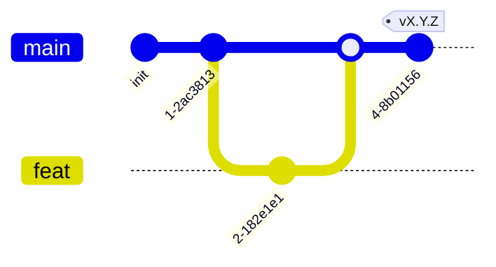

# AGENTS.md — правила работы в сервис-репозитории

Точка входа для людей и AI-агентов в **репозитории одного сервиса** —
`cybercity-manage`, контрольная плоскость кибер-полигона CyberCity (Go). Здесь
только **правила** (ветвление, что можно/нельзя, коммиты, язык, команды стека)
и указатели. Процедуры — в методологии (`<methodology-repo>/docs/guide/`),
факты — в `<methodology-repo>/docs/refs/`. Начни с
`<methodology-repo>/docs/INDEX.md`.

> `<methodology-repo>` =
> [TheCipherKeeper/ai-project-template](https://github.com/TheCipherKeeper/ai-project-template).
> Хаб программы — [TheCipherKeeper/cybercity](https://github.com/TheCipherKeeper/cybercity)
> (`COMPOSITION.md`, `CONVENTIONS.md`, `adr/`).

> Это репо **одного микросервиса** (инстанциация из `skeletons/service/`
> методологии). Внутри — workspace из модулей, у каждого своя спека. Сервис
> реализуется **на Go** (формально —
> [ADR-0009](https://github.com/TheCipherKeeper/cybercity/blob/main/adr/0009-manage-implementation-language-go.md);
> один сервис — один язык). Сервис — клиент **брокера** (Redpanda, один на
> систему) и деплоится **контейнером** со своим `Dockerfile`. manage —
> **брокер-publisher** infra/control-событий + выставляет control API движку
> (см. `docs/ARCHITECTURE.md` → *Доверительная граница*).
>
> Системный контекст (состав программы, event envelope, системный compose,
> ADR) — в **хабе**; топология репозиториев —
> `<methodology-repo>/docs/refs/TOPOLOGY.md`, общение микросервисов —
> `<methodology-repo>/docs/refs/COMMUNICATION.md`.

## Документация (приоритет)

В порядке убывания **по ярусам**: хаб → этот `AGENTS.md` →
методология (`<methodology-repo>/docs/guide/` и `/docs/refs/` — **равные**,
разные виды) → рабочие артефакты (`docs/ARCHITECTURE.md`, `docs/BACKLOG.md`,
`docs/specs/`) → код.

`<methodology-repo>/docs/INDEX.md` — роутер методологии. Приоритет
арбитражирует **только между ярусами**. Противоречие **внутри яруса** (в т.ч.
`guide/` против `refs/`) — **дефект**, а не «старший побеждает»: чинят к одной
правде либо фиксируют в ADR (`<methodology-repo>/docs/guide/60-adr.md`, ADR
живут в хабе `cybercity/adr/`).

## Модель ветвления



- `main` — стабильная, единственная интеграция. Вливается из feature-веток через PR.
- `feat/<задача>` — от `main`, удаляется после merge.
- Прямой коммит в `main` — **запрещён**. Только feature-ветка + PR.
- Релизы — тегами `vX.Y.Z` (semver) на `main`; release-ветки не заводятся
  (`<methodology-repo>/docs/guide/70-release.md`).

Процедура работы — `<methodology-repo>/docs/guide/30-implement-task.md`.

## Команды проверки (выбранный стек)

Стек — **Go** (формально по
[ADR-0009](https://github.com/TheCipherKeeper/cybercity/blob/main/adr/0009-manage-implementation-language-go.md)).
Полная конфигурация toolchain'а —
`<methodology-repo>/docs/refs/STACKS.md`. Прогон перед коммитом —
`<methodology-repo>/docs/guide/40-verify.md`.

| Стек | lint | test | build |
|---|---|---|---|
| **Go** | `gofmt -l . && go vet ./...` | `go test ./...` | `go build -o bin/cybercity-manage ./cmd/cybercity-manage` |

> `gofmt -l .` должен вывести пусто. Опц. `golangci-lint run`.
>
> **Честно об окружении:** toolchain `go` в окружении агента **не установлен** —
> lint/test/build локально не прогоняются. Репо содержит лишь stub-точку входа
> (`cmd/cybercity-manage/main.go`), реального кода контрольной плоскости пока
> нет (см. `docs/ARCHITECTURE.md` → *Модули*, всё помечено TODO). Прогон
> откладывается на фазу заведения кода; на конформность методологии (Phase 1b)
> не влияет.

## Указатели на процедуры (в методологии)

- Войти в проект — `<methodology-repo>/docs/guide/00-bootstrap.md`.
- Описать архитектуру — `<methodology-repo>/docs/guide/10-architecture.md`.
- Добавить модуль / спеку — `<methodology-repo>/docs/guide/20-define-module.md`.
- Внутренняя архитектура модуля (usecases/ports/domain/adapters) —
  `<methodology-repo>/docs/refs/MODULE.md`.
- Взять задачу, реализовать — `<methodology-repo>/docs/guide/30-implement-task.md`.
- Проверить перед коммитом — `<methodology-repo>/docs/guide/40-verify.md`;
  теория — `<methodology-repo>/docs/refs/VERIFICATION.md`.
- Запустить локально — `<methodology-repo>/docs/guide/50-deploy.md`;
  структура compose/Dockerfile — `<methodology-repo>/docs/refs/DEPLOYMENT.md`.
- Записать ADR — `<methodology-repo>/docs/guide/60-adr.md` (ADR — в хабе
  `cybercity/adr/`).
- Выпустить версию (тег) — `<methodology-repo>/docs/guide/70-release.md`.

## Что можно

- Писать код в модулях сервиса (workspace под `internal/`, `cmd/`) и (опц.) `shared/`.
- Менять конфигурацию сборки/манифесты (`go.mod`) с обоснованием.
- Менять `Dockerfile`, корневой `docker-compose.yml` (локальная разработка:
  брокер + сервис), `.env.example` с обоснованием.
- Обновлять `docs/` (рабочие артефакты: `ARCHITECTURE`/`BACKLOG`/`specs`). ADR —
  в хабе `cybercity/adr/` (см.
  [ADR-0005](https://github.com/TheCipherKeeper/cybercity/blob/main/adr/0005-adr-centralized-in-hub.md)).
- Создавать feature-ветки, коммитить, пушить, открывать PR в `main`.
- Заводить новые модули в workspace'е (со спекой — `guide/20`).

## Что нельзя

- Коммитить напрямую в `main`.
- Заводить `dev`/release-ветки — интеграция через PR в `main`, версии — тегами.
- Смешивать стеки (один сервис — один язык; manage — Go).
- Вводить системный multi-service compose или кросс-сервисные контракты в этом
  репо — это зона хаба (`<methodology-repo>/docs/refs/TOPOLOGY.md`).
- Прямую **service-to-service** связность в обход брокера
  (`<methodology-repo>/docs/refs/COMMUNICATION.md`).
  **Presentation-эндпоинты (HTTP/WS) для интерфейсов — разрешены** и
  документируются в `docs/ARCHITECTURE.md` → *Доверительная граница*. У manage
  presentation-эндпоинтов **нет** (это control-plane сервис без UI); его
  control API `manage → engine` — **разрешённый control-plane edge**
  (документирован в `docs/ARCHITECTURE.md` → *Доверительная граница* как
  control-plane edge, не как presentation), per хаб COMPOSITION «Кто чем
  владеет».
- Создавать ADR вне хаба (`cybercity/adr/`; процедура — `guide/60`).
- Отклоняться от usecase-структуры модуля
  (`<methodology-repo>/docs/refs/MODULE.md`) — отклонение через ADR в хабе
  (`cybercity/adr/`; процедура — `guide/60`), не тихим отступлением.
- Добавлять зависимости (включая образы в compose) без обоснования.
- Выдавать stub за реализацию — честно помечать placeholder/TODO.
- Трогать lock-файлы (`go.sum`), `.env`, артефакты сборки (`bin/`) без одобрения.
- Описывать in-guest действие как способ reset/изоляции (нарушает
  доверительную границу — действие над гостем только через `manage`/фабрику).
- Переписывать provisioning заново — manage оркестрирует реальный IaC
  (Terraform/Pulumi) под собой, не дублирует.

## Коммиты

Conventional Commits. Scope — имя модуля или `deploy`/`docs`. Тело — на
русском; summary-строка — английский допустим.

```
feat(<module>): add zfs-snapshot provisioning
fix(<module>): reject invalid runtime_kind in service-mapping
docs: update ARCHITECTURE.md with module matrix
refactor(<module>): extract envelope publishing
chore(deploy): pin redpanda image in compose
```

Breaking changes — `BREAKING CHANGE:` в теле.

## Язык

Документация — русский. Английский допустим только для идентификаторов кода,
имён модулей/библиотек, `Status:` в ADR, summary-строки коммита, бейджей.