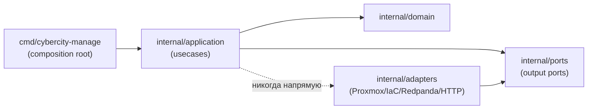
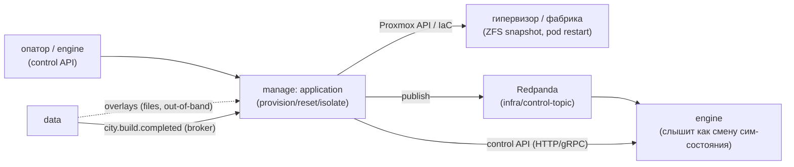

# Архитектура

> Скелет одного микросервиса. Стек —
> [TheCipherKeeper/ai-project-template](https://github.com/TheCipherKeeper/ai-project-template)/docs/refs/STACKS.md,
> раскладка workspace'а — `…/docs/refs/LAYOUT.md`, деплой —
> `…/docs/guide/50-deploy.md` + `…/docs/refs/DEPLOYMENT.md`. Процедура заполнения
> — `…/docs/guide/10-architecture.md`. Структура секций читается и людьми, и
> агентами.
>
> Состав программы (несколько сервисов, системная топология) — в хабе
> [`cybercity/COMPOSITION.md`](https://github.com/TheCipherKeeper/cybercity/blob/main/COMPOSITION.md).
> Здесь — только этот сервис (`cybercity-manage`) и его граница с системой.
>
> **Целевая архитектура.** Кода контрольной плоскости пока нет; этот документ
> описывает цель, к которой идёт репозиторий (стартовая точка). Модули в
> таблице — **запланированные** (TBD), помечены явно. Stub-точка входа
> `cmd/cybercity-manage/main.go` существует лишь для собираемости образа и
> честно помечена как placeholder.

## Что это

`cybercity-manage` — **контрольная плоскость** кибер-полигона CyberCity
(Go). Единственный инфра-мутатор программы: оркеструет гипервизор (Proxmox API)
и реальный IaC (Terraform/Pulumi) для provisioning узлов, reset/rollback к
чистому состоянию, сетевой изоляции сегментов и квот/мульти-тенантности;
generic consumer `overlays`-артефакта (собирает образы через Packer/Ansible по
`service-mapping` + `overlay-id`, деплоит — семантики vuln не знает).
Системный контекст — хаб
[`cybercity/COMPOSITION.md`](https://github.com/TheCipherKeeper/cybercity/blob/main/COMPOSITION.md)
(состав, контракты, доверительная граница).

## Что делает

1. **Provisioning** — создание/удаление/старт/стоп runtime-целей по
   service-mapping manifest (`runtime_kind ∈ {vm, container, lite}`; по
   умолчанию `lite`) через Proxmox API (ZFS snapshot/clone для `vm`, pod
   restart для `container`/`lite`).
2. **Reset / rollback** — откат к чистому состоянию за секунды: ZFS/CoW
   snapshot/clone золотых образов (`vm`), пересоздание pod'а (`container`/`lite`).
3. **Сетевая изоляция** — VLAN/firewall на Proxmox для сегментов; Cilium /
   NetworkPolicy / gVisor / Kata для контейнерных целей в adversarial-режиме.
   Ключевое свойство: нет маршрута из range-сегментов в mgmt.
4. **Квоты / TTL / мульти-тенантность** — per-team/per-tenant бюджеты
   CPU/RAM/disk, TTL на инстансы (автоуничтожение), изоляция арендаторов через
   сегменты и сетевые политики.
5. **Generic consumption `overlays`-артефакта** — по `service-mapping` +
   `overlay-id` собирает образы (Packer/Ansible) и деплоит. **Семантики vuln не
   знает** — generic потребитель; vuln — first-class сущность в `cybercity-data`
   ([ADR-0006](https://github.com/TheCipherKeeper/cybercity/blob/main/adr/0006-vulnerability-declarative-overlay-realism.md)).
6. **Control API движку** — выставляет `manage → engine` control API
   (HTTP/gRPC: старт/пауза/сброс сценария, запрос снапшота, reload топологии) —
   разрешённый control-plane edge (см. *Доверительная граница*).
7. **Брокер-publisher** — публикует infra/control-события в Redpanda
   (`infra.provisioned`, `control.snapshot`/`control.reset`/`control.isolate`);
   engine слышит их как смену сим-состояния. Опционально потребляет
   `city.build.completed` (знать о готовности сборки перед провижнингом —
   TODO, пока не подключено).

## Чего не делает

- **Не считает scoring.** Scoring — на потоке `collector → engine`.
- **Не наблюдает гостей.** Наблюдение — задача `cybercity-collector`
  (out-of-band, read-only).
- **Не пишет world-state / события в причинный граф.** `engine` — единственный
  мутатор world-state; manage только меняет инфру и уведомляет.
- **Не знает семантики vuln.** manage — generic consumer `overlays`: собирает
  образы по `overlay-id`, не владеет контентом уязвимости.
- **Не переписывает provisioning.** Оркестрирует реальный IaC
  (Terraform/Pulumi) под собой, не дублирует.
- **Не действует in-guest.** Reset/изоляция — через гипервизор/фабрику, не через
  in-guest агента (доверительная граница).
- **Не имеет UI / presentation-эндпоинтов.** manage — control-plane сервис без
  интерфейса; его control API — control-plane edge, не presentation (см.
  *Доверительная граница*).

## Модули

> **TODO: кода пока нет.** Таблица — целевой макет (запланированные Go-модули),
> не текущая реализация. Каждый модуль заведётся по процедуре
> `…/docs/guide/20-define-module.md` со своей спекой в `docs/specs/<module>.md`.
> Stub `cmd/cybercity-manage/main.go` — placeholder для собираемости образа.

| Модуль | Роль | Публикует / Читает (топики) |
|---|---|---|
| `cmd/cybercity-manage` | точка входа: composition root, CLI/HTTP-control-API stub | — (стартует приложение) |
| `internal/domain` | чистая доменная логика: desired-state, quota, policy, `runtime_kind`, service-mapping (без I/O) | — (чистая, без топиков) |
| `internal/ports` | output ports: `HypervisorClient`, `IacRunner`, `OverlayConsumer`, `EventPublisher`, `ControlAPI` (Go-интерфейсы, без I/O) | — (контракты, не реализация) |
| `internal/adapters` | реализации output ports: Proxmox (`bpg/proxmox-go-sdk`), Terraform/Pulumi (`terraform-exec`/Pulumi SDK), Redpanda publisher, HTTP control-API server, ZFS snapshot, gVisor/Kata, collector-placement | publish: `infra.provisioned`, `control.snapshot`, `control.reset`, `control.isolate` (через Redpanda-адаптер) |
| `internal/application` | оркестрация юзкейсов: `provision`, `reset`, `isolate`, `set-quota`, `place-collector`, `map-runtime-kind`, `reload-topology`, `control-snapshot` | publish через `EventPublisher`; consume (опц.) `city.build.completed` |

Зависимости между модулями (DAG, целевой):

> Швы и направление зависимостей —
> [TheCipherKeeper/ai-project-template](https://github.com/TheCipherKeeper/ai-project-template)/docs/refs/MODULE.md:
> `application` (usecases) зависит только от `ports` + `domain`, **никогда** от
> `adapters`; `adapters` реализуют `ports`; `domain` ни от чего внутри модуля не
> зависит. Инварианты #13, #14 — `…/docs/refs/VERIFICATION.md`.

## Брокер

- **Брокер:** Redpanda (один на систему). Адрес локальной разработки — из
  `docker-compose.yml`, сервис `broker` (`broker:9092`).
- **Контракты хаба:** `CONVENTIONS@v1` — пин версии, по которой гейт проверяет
  сервис (см.
  [TheCipherKeeper/ai-project-template](https://github.com/TheCipherKeeper/ai-project-template)/docs/refs/VERIFICATION.md,
  процедура — `…/docs/guide/40-verify.md`). Бамп пина — отдельным PR. Формат
  сообщений (event envelope) — хаб
  [`cybercity/CONVENTIONS.md`](https://github.com/TheCipherKeeper/cybercity/blob/main/CONVENTIONS.md).

manage — **брокер-publisher** infra/control-событий; опционально consumer
`city.build.completed`. Потребление `overlays`-артефакта — **out-of-band файл**
(не брокер) — отмечено отдельно ниже таблицы.

Топики сервиса:

| Топик | Направление | Назначение |
|---|---|---|
| `infra.provisioned` | publish | уведомление: provisioning runtime-цели завершён (engine слышит как смену сим-состояния) |
| `control.snapshot` | publish | уведомление: сделан снапшот узла/сегмента (control-topic → engine) |
| `control.reset` | publish | уведомление: выполнен reset/rollback узла (control-topic → engine) |
| `control.isolate` | publish | уведомление: сегмент изолирован (control-topic → engine) |
| `city.build.completed` | consume (опц., TODO) | событие готовности сборки от `data` — знать, что build готов перед провижнингом; **пока не подключено** — честно TODO |

> **Out-of-band (не брокер):** `overlays`-артефакт (каталог уязвимостей + tarball
> overlay-плейбуков) — контракт **data → manage** файловый
> ([ADR-0006](https://github.com/TheCipherKeeper/cybercity/blob/main/adr/0006-vulnerability-declarative-overlay-realism.md));
> manage — generic consumer: по `service-mapping` + `overlay-id` собирает образы
> (Packer/Ansible) и деплоит. В таблицу топиков не входит — это файловый контракт,
> не брокерный.

## Потоки данных

### Поток 1: provisioning

1. Команда оператора/engine (control API) → manage: `provision service_id`.
2. manage (application) → `HypervisorClient` (Proxmox API): создание/старт
   цели по `runtime_kind` из service-mapping (`vm`=golden image ZFS clone,
   `container`=образ, `lite`=cc-lite stub).
3. manage → `EventPublisher` (Redpanda): публикация `infra.provisioned`.
4. engine слышит `infra.provisioned` как смену реестра целей (не мутирует инфру).

### Поток 2: reset / rollback

1. Команда (control API) или engine-запрос → manage: `reset node_id`.
2. manage → `HypervisorClient`: ZFS snapshot/clone rollback (`vm`) или pod
   пересоздание (`container`/`lite`).
3. manage → `EventPublisher`: публикация `control.reset`.
4. engine слышит как смену сим-состояния.

### Поток 3: изоляция

1. Команда → manage: `isolate segment_id`.
2. manage → `HypervisorClient` / сетевой адаптер: VLAN/firewall на Proxmox /
   Cilium NetworkPolicy / gVisor/Kata.
3. manage → `EventPublisher`: публикация `control.isolate`.

### Поток 4: generic consumption overlays (out-of-band)

1. `data` собирает `overlays`-артефакт (файл, не брокер) + публикует
   `city.build.completed` (опц., TODO).
2. manage (OverlayConsumer) читает `overlays` по `service-mapping` + `overlay-id`,
   собирает образы (Packer/Ansible), деплоит. Семантики vuln не знает.

## Доверительная граница

manage живёт в **trusted plane** (mgmt-сегмент) вместе с `collector` и
Redpanda-брокером; драйвит гипервизор (Proxmox: ZFS snapshot/clone для `vm`,
pod restart для `container`/`lite`); оркестрирует реальный IaC
(Terraform/Pulumi/Ansible) под собой, **не** переписывает provisioning; generic
consumer `overlays`-артефакта (собирает образы по service-mapping + overlay-id,
деплоит — **не** знает семантики vuln).

- **Trusted (внутри границы):** `cybercity-manage` + `cybercity-collector` +
  Redpanda — mgmt-сегмент, без маршрута из range. На их потоке считается
  scoring. mTLS + ACL на mgmt-плоскости.
- **Best-effort / untrusted (снаружи границы):** всё внутри гостей — никогда
  не источник для scoring; in-guest enrichment — опционально, best-effort.
- **Действие над гостем** (reset/изоляция) — только через `manage`/фабрику, не
  через in-guest агента.
- Канон границы —
  [`cybercity/adr/0002-trust-boundary.md`](https://github.com/TheCipherKeeper/cybercity/blob/main/adr/0002-trust-boundary.md).

### Control-plane edge (manage → engine)

manage ↔ engine — два канала (per хаб COMPOSITION «Кто чем владеет»):

1. **Control API `manage → engine`** (HTTP/gRPC: старт/пауза/сброс сценария,
   запрос снапшота, reload топологии) — **разрешённый control-plane edge**,
   исключение из «no service-to-service bypass of broker». Документировано здесь
   как control-plane edge (не interface presentation). engine — авторитарный
   world-state-мутатор; manage координирует engine через control API и
   Redpanda, но world-state не владеет (engine — единственный читатель/писатель
   PostgreSQL; manage в БД не ходит).
2. **Redpanda control-topic `manage → engine`** — уведомления об изменениях
   инфры (`infra.provisioned`, `control.snapshot`/`control.reset`/`control.isolate`);
   engine слышит как смену сим-состояния (см. таблицу топиков выше).

> manage **не выставляет presentation-эндпоинты для интерфейсов** — у сервиса
> нет UI. Его HTTP/gRPC-точка — control-plane edge к engine, потребляемый
> engine (и оператором), а не интерфейсом. Честно N/A для presentation-table.

## Деплой

- Сервис — контейнер со своим `Dockerfile` (Go multi-stage: `golang` build →
  distroless/alpine runtime); expose control API port (`MANAGE_HTTP_ADDR`,
  по умолчанию `:8081`). Локальная разработка — `docker-compose.yml`
  (брокер Redpanda + manage). Детали —
  [TheCipherKeeper/ai-project-template](https://github.com/TheCipherKeeper/ai-project-template)/docs/refs/DEPLOYMENT.md,
  запуск — `…/docs/guide/50-deploy.md`.
- Системный compose (все сервисы программы вместе) — в хабе, не здесь.
- Соответствие хабу (на пиннённой версии контрактов `CONVENTIONS@v1`) —
  verification-гейт (`…/docs/refs/VERIFICATION.md`, процедура — `…/docs/guide/40-verify.md`).

## Ссылки

- Хаб: [COMPOSITION.md](https://github.com/TheCipherKeeper/cybercity/blob/main/COMPOSITION.md)
  (состав, контракты, доверительная граница),
  [CONVENTIONS.md](https://github.com/TheCipherKeeper/cybercity/blob/main/CONVENTIONS.md)
  (event envelope, `CONVENTIONS@v1`),
  [adr/](https://github.com/TheCipherKeeper/cybercity/blob/main/adr/)
  (ADR-0001…0010, единый дом).
- Методология:
  [TheCipherKeeper/ai-project-template](https://github.com/TheCipherKeeper/ai-project-template)
  — `docs/guide/` (процедуры), `docs/refs/` (факты), `docs/INDEX.md` (роутер).
- Ключевые ADR (в хабе):
  [ADR-0002](https://github.com/TheCipherKeeper/cybercity/blob/main/adr/0002-trust-boundary.md)
  (доверительная граница),
  [ADR-0004](https://github.com/TheCipherKeeper/cybercity/blob/main/adr/0004-runtime-kind-vm-container-lite.md)
  (`runtime_kind {vm, container, lite}`),
  [ADR-0005](https://github.com/TheCipherKeeper/cybercity/blob/main/adr/0005-adr-centralized-in-hub.md)
  (ADR в хабе),
  [ADR-0006](https://github.com/TheCipherKeeper/cybercity/blob/main/adr/0006-vulnerability-declarative-overlay-realism.md)
  (`overlays`-артефакт),
  [ADR-0009](https://github.com/TheCipherKeeper/cybercity/blob/main/adr/0009-manage-implementation-language-go.md)
  (manage на Go).
- Этот репо: [`AGENTS.md`](../AGENTS.md) (правила),
  [`docs/BACKLOG.md`](BACKLOG.md) (очередь задач),
  [`docs/specs/`](specs/) (контракты модулей),
  [`docs/DEVELOPMENT.md`](DEVELOPMENT.md) (целевой стек и тестирование).